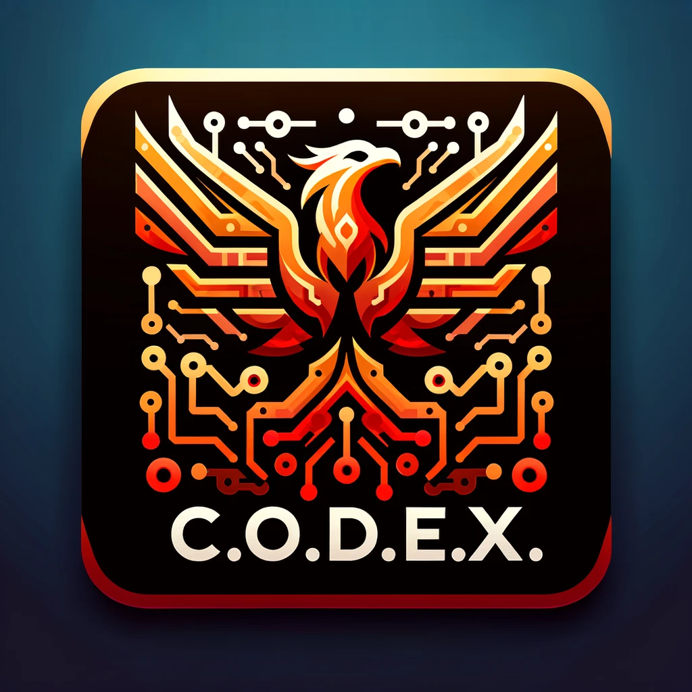
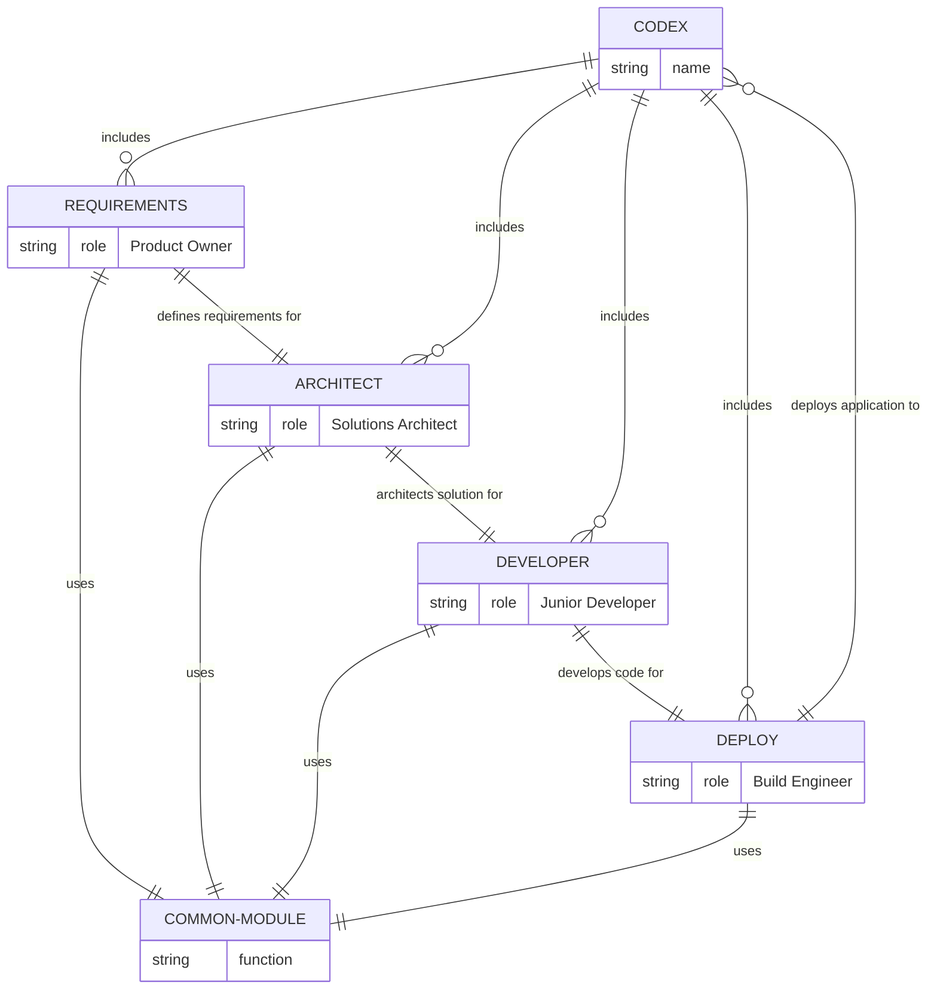
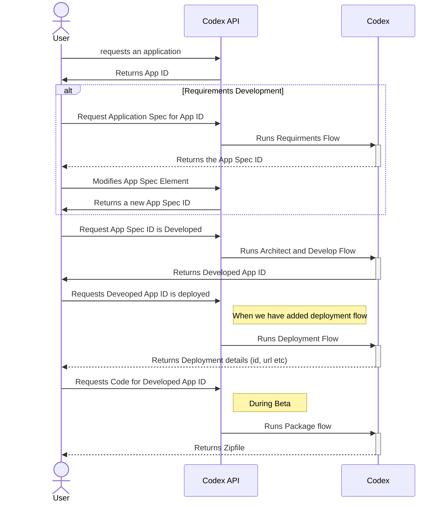
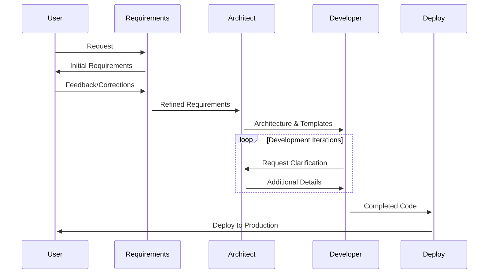
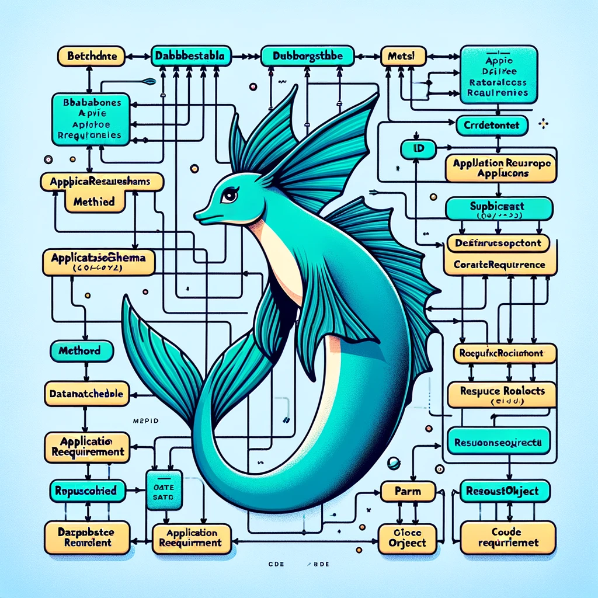
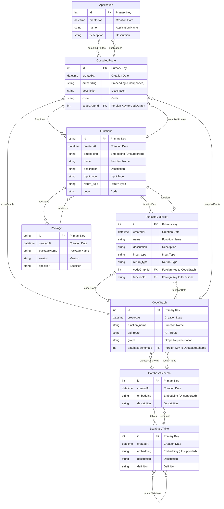

<p align="center">
    
</p>

## Introduction

The Codex System is an innovative coding agent designed to streamline the software development process. It consists of four key sub-agents, each specialized in a different aspect of software development. These sub-agents work in harmony to ensure efficient and effective delivery of software applications. This README provides an overview of the Codex System and its components.

## Setup Guide 

Welcome to the initial setup guide for your project. Follow these easy steps to get everything up and running.

### Step 1: Install Dependencies

**Install Packages**

Start by installing all necessary dependencies. In your terminal, run:

```
poetry install
poetry shell
```

This command installs all Python package dependencies required by your project.

**Select Poetry Python Interpreter**

Now make sure you're using the poetry Python interpreter:

In VSCode, bring up the "Show and Run Commands" view by pressing: `Ctrl/Cmd + Shift + P`

Then input:
```
> Python: Select Interpreter
```
And select the Poetry Python Interpreter.

### Step 2: Initialize Docker Containers
Remember to remove the app service, if you want to run only the DB. 

Next, set up the Docker containers by executing:

```
docker compose up
```

To have docker compose watch file changes and automatically rebuild, execute:

```
docker compose alpha watch 
```

This spins up the necessary Docker containers as defined in your `docker-compose.yml`, ensuring your environment is correctly isolated.

> Take note of the **port** printed in the output. e.g: `listening on IPv4 address "0.0.0.0", port 5432`.

### Step 3: Configure and Migrate Database

In a new terminal, copy the .env file template:

```
cp .env.example .env
```

To set up your database, we'll begin by configuring the `DATABASE_URL` through an environment variable. 

Simply set the database `port` you took note of above (e.g. 5432).

Then, take this oppertunity to update the .env with your OpenAI key.

Once you've updated the .env file with this info, launch a Poetry Shell:
```
poetry shell
```

Now migrate your database schema with:

```
prisma migrate dev --name init
```

This initializes your database with the required schema.

### Step 4: Generate Prisma Client

After migrating your database, generate the Prisma client to interact with your database in your application:

```
prisma generate
```

This command generates or updates the Prisma client, ensuring your application can communicate effectively with the database.

### Step 5: Populate the Database

Ensure your database is populated with initial data by adjusting the database URL for the specific port and running the population script:

```
./run populate-db
```

This populates your database with the initial data set required for your application.

### Step 6: Launch the Application

Set your environment to local and start the server:

```
./run serve
```

This starts the application's server, making it available for development use.

### Step 7: Access the Documentation

Access the running application's interactive documentation at:

```
http://127.0.0.1:8000/docs
```

Here, you'll find detailed guides and references on interacting with the application.

### What's Next?

With your environment set up, head over to the **Interaction Flow** section for insights on how interactions within the application work, further exploring its functionality and features.

## Components of Codex

The Codex System is an advanced software development framework comprised of various specialized sub-agents and components. Each component plays a critical role in the software development lifecycle, from conception to deployment. In addition to the primary sub-agents, the Codex System includes essential supportive components: the Common Module, Chains Module, and Prompts Module.

1. **Requirements (Product Owner)**: This component is pivotal in understanding and defining the product requirements. It acts as a bridge between the client's needs and the technical team, ensuring that the developed software aligns perfectly with the client's vision.

2. **Architect (Solutions Architect)**: Responsible for crafting the overall architecture of the application. This component breaks down the application into manageable modules and writes the templates that guide the development process.

3. **Developer**: The hands-on coding component. Utilizing the templates and guidelines provided by the Architect, the Developer sub-agent is responsible for writing the individual functions and pieces of the application.

4. **Deploy Agent**: The final phase of the software development process, this component is tasked with compiling, packaging, and deploying the completed application, ensuring its successful deployment to the designated environment.

5. **Common Module**: A fundamental component used across all stages of development. It provides shared functionalities and resources, such as libraries and tools, that are essential for the Design, Architect, Coding, and Delivery modules. This module ensures consistency and efficiency in the development process.

6. **Prompts**: This component works closely with the Chains Module to generate and manage prompts for LLM interactions. It holds all the prompt templates allowing us to easily itterate prompt design without needing to modify the code.

Below is a diagram illustrating the structure of the Codex System and the interaction between its components:



## Interaction Flow

This is what the expected user interaction workflow will look like:



## Workflow

1. **Requirement Analysis**: The Design sub-agent interacts with the client to gather and define the product requirements.

2. **Architecture Design**: Based on the requirements, the Architect sub-agent develops a solution architecture, breaking down the application into smaller, manageable modules and creating templates.

3. **Development**: The Developer sub-agent uses the templates and architecture guidelines to write the actual code for each module of the application.

4. **Deployment**: Once the coding is complete, the Deploy sub-agent takes over to package, compile, and deploy the application to the desired environment.



## Database Schema

<p align="center">
    
</p>

The schema revolves around key models:

- CodeGraph: Represents the logic and structure of code as graphs, linked to function definitions and database schemas.
- FunctionDefinition: Defines individual functions with details like input/output types, tied to specific CodeGraphs.
- CompiledRoute: Transforms CodeGraphs into executable routes, integral for the application's runtime.
- Application: The aggregate entity that combines multiple CompiledRoutes into a complete application.
- Functions and Package: Detail the executable elements and dependencies within the application.
- DatabaseSchema and DatabaseTable: Manage database interactions within the generated code, facilitating data-driven functionalities.

This schema is pivotal for automating code generation, from defining logic in CodeGraphs to the final application assembly, enhancing our application's efficiency and scalability.



## Useful commands

> docker buildx build --platform linux/amd64 -t gcr.io/agpt-dev/mvp/codegen . --push

## Prisma with Python: Quick Setup and Usage Guide

Prisma is an open-source database toolkit that simplifies database access and management. Although Prisma is traditionally associated with JavaScript and TypeScript, it can also be integrated with Python projects. This section of the README provides a quick cheat sheet for setting up Prisma in a Python environment, applying migrations, and other useful tips.

### 1. Setting Up Prisma

#### Prerequisites:

- Node.js installed (for Prisma CLI)
- Python environment setup

#### Steps:

1. **Install Prisma CLI**:

   - Use npm to install Prisma globally:
     ```bash
     npm install -g prisma
     ```

2. **Initialize Prisma in Your Project**:

   - Navigate to your Python project directory and initialize Prisma:
     ```bash
     prisma init
     ```
   - This command creates a new `prisma` directory with a default `schema.prisma` file.

3. **Configure Your Database**:
   - In `schema.prisma`, configure the `datasource` block to point to your database. For example, for PostgreSQL:
     ```prisma
     datasource db {
       provider = "postgresql"
       url      = env("DATABASE_URL")
     }
     ```
   - Replace `DATABASE_URL` with your database connection string.

### 2. Defining Your Data Model

- In the `schema.prisma` file, define your data models. For example:
  ```prisma
  model User {
    id    Int     @id @default(autoincrement())
    name  String
    email String  @unique
  }
  ```

### 3. Migrations

#### Creating Migrations:

- After defining your models, create a migration to update the database schema:
  ```bash
  prisma migrate dev --name init
  ```
- This command creates SQL files in the `prisma/migrations` directory.

#### Applying Migrations:

- Apply migrations to update your database schema:
  ```bash
  prisma migrate deploy
  ```

### 4. Generating Prisma Client

- Generate Prisma Client to interact with your database:
  ```bash
  prisma generate
  ```

### 5. Using Prisma with Python

- Since Prisma Client is native to JavaScript/TypeScript, using it in Python requires a workaround. You can execute Prisma Client through a child process. For example:

  ```python
  import subprocess
  import json

  def run_prisma_command(command):
      result = subprocess.run(["npx", "prisma", *command], capture_output=True)
      return json.loads(result.stdout)

  users = run_prisma_command(["query", "user", "--all"])
  print(users)
  ```

### 6. Useful Commands

- **Introspect Database**: To update your Prisma schema based on an existing database:
  ```bash
  prisma introspect
  ```
- **Studio**: Prisma Studio provides a GUI to view and edit data in your database:
  ```bash
  prisma studio
  ```

### Conclusion

This cheat sheet covers the basics of setting up Prisma in a Python project and performing essential database operations. Remember that using Prisma with Python is less straightforward than with JavaScript/TypeScript, and it may require additional setup and handling. For more detailed information, refer to the [Prisma Documentation](https://www.prisma.io/docs/).

