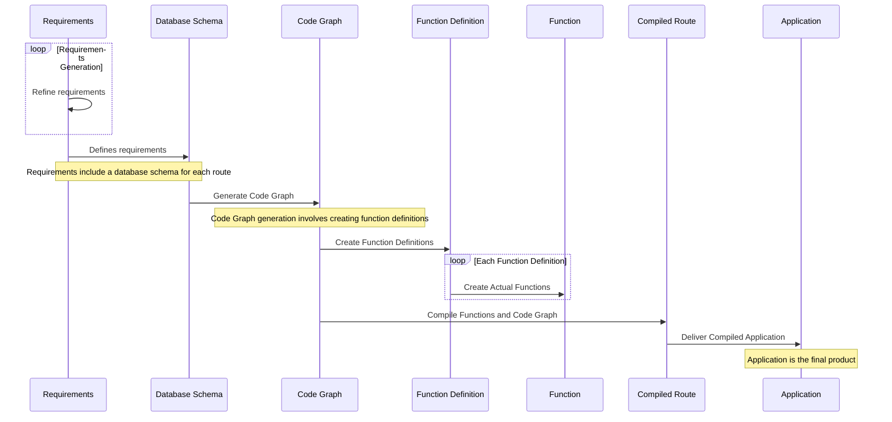
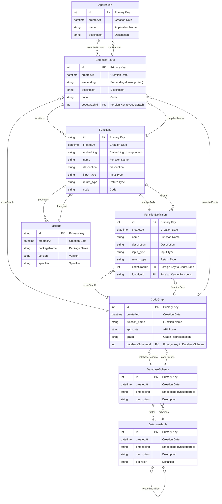

    

# Introduction

Rough application flow.

##  Database Schema

The schema revolves around key models:

- CodeGraph: Represents the logic and structure of code as graphs, linked to function definitions and database schemas.
- FunctionDefinition: Defines individual functions with details like input/output types, tied to specific CodeGraphs.
- CompiledRoute: Transforms CodeGraphs into executable routes, integral for the application's runtime.
- Application: The aggregate entity that combines multiple CompiledRoutes into a complete application.
- Functions and Package: Detail the executable elements and dependencies within the application.
- DatabaseSchema and DatabaseTable: Manage database interactions within the generated code, facilitating data-driven functionalities.

This schema is pivotal for automating code generation, from defining logic in CodeGraphs to the final application assembly, enhancing our application's efficiency and scalability.

## Useful commands 
> docker buildx build --platform linux/amd64 -t gcr.io/agpt-dev/mvp/codegen . --push
