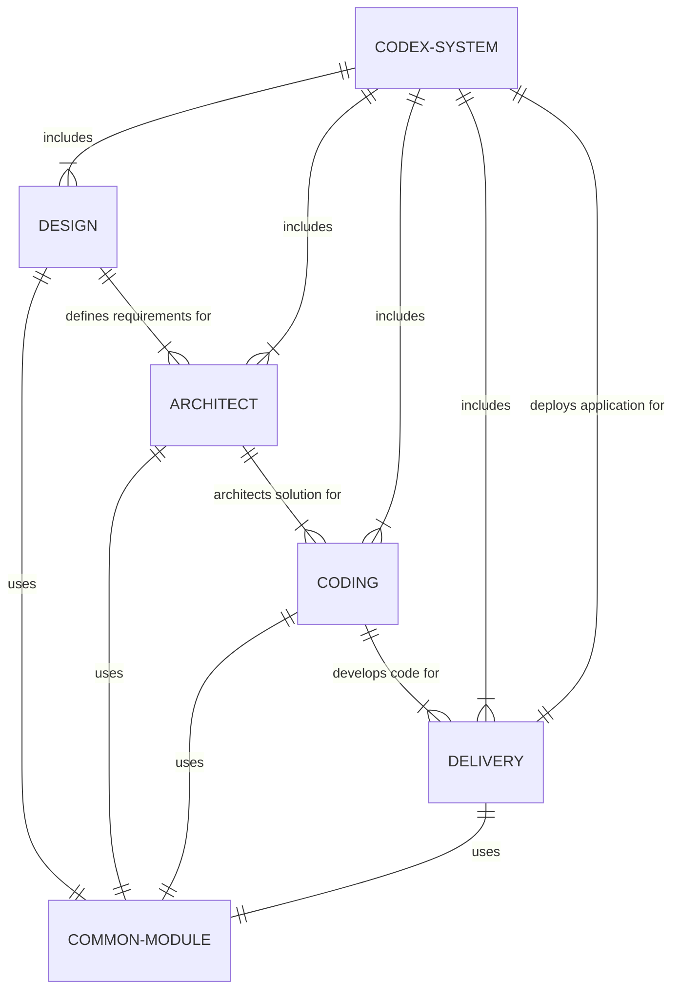

    

## Introduction

The Codex System is an innovative coding agent designed to streamline the software development process. It consists of four key sub-agents, each specialized in a different aspect of software development. These sub-agents work in harmony to ensure efficient and effective delivery of software applications. This README provides an overview of the Codex System and its components.

## Components of Codex

The Codex System is comprised of the following sub-agents:

1. **Design (Product Owner)**: This component focuses on understanding and defining the product requirements. It acts as the bridge between the client's needs and the technical team, ensuring that the software developed aligns with the client's vision.

2. **Architect (Solutions Architect)**: Responsible for devising the overall architecture of the application. This component breaks down the application into manageable pieces and writes the templates that guide the development process.

3. **Coding (Junior Developer)**: This is the hands-on coding component. Based on the templates and guidelines provided by the Architect, the Coding sub-agent writes the individual functions and pieces of the application.

4. **Delivery (Deployment Agent)**: The final component is responsible for compiling, packaging, and deploying the completed application. It ensures that the software is successfully deployed to the relevant environment.

## Mermaid Diagram

Below is a Mermaid diagram illustrating the structure of the Codex System and the interaction between its components:

## Workflow

1. **Requirement Analysis**: The Design sub-agent interacts with the client to gather and define the product requirements.

2. **Architecture Design**: Based on the requirements, the Architect sub-agent develops a solution architecture, breaking down the application into smaller, manageable modules and creating templates.

3. **Development**: The Coding sub-agent uses the templates and architecture guidelines to write the actual code for each module of the application.

4. **Deployment**: Once the coding is complete, the Delivery sub-agent takes over to package, compile, and deploy the application to the desired environment.

##  Database Schema

The schema revolves around key models:

- CodeGraph: Represents the logic and structure of code as graphs, linked to function definitions and database schemas.
- FunctionDefinition: Defines individual functions with details like input/output types, tied to specific CodeGraphs.
- CompiledRoute: Transforms CodeGraphs into executable routes, integral for the application's runtime.
- Application: The aggregate entity that combines multiple CompiledRoutes into a complete application.
- Functions and Package: Detail the executable elements and dependencies within the application.
- DatabaseSchema and DatabaseTable: Manage database interactions within the generated code, facilitating data-driven functionalities.

This schema is pivotal for automating code generation, from defining logic in CodeGraphs to the final application assembly, enhancing our application's efficiency and scalability.

## Useful commands 
> docker buildx build --platform linux/amd64 -t gcr.io/agpt-dev/mvp/codegen . --push
